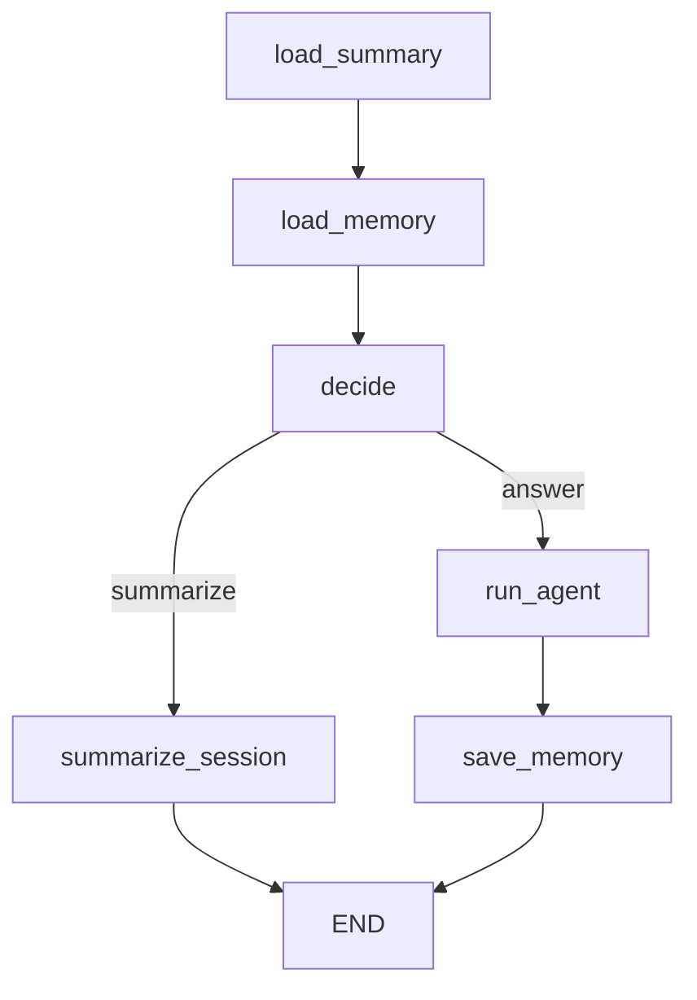

# LangGraph Agent with Letta-style Memory (PoC)

This project demonstrates a LangChain + LangGraph agent capable of session summarization and memory reuse.  
It follows a Letta-style structure, storing key takeaways from prior sessions and injecting them into the next agent prompt.

## 🔧 Features

- LangGraph-driven agent control  
- Conditional flow between summarization and answering  
- Persistent memory via Chroma  
- Session-based memory separation  
- Streamlit UI for local exploration

## 📂 Structure

```bash
memory-demo/
├── main.py              # Streamlit app  
├── langgraph_demo.py    # Graph construction and agent logic  
├── memory_adapter.py    # ChromaMemoryAdapter implementation  
├── .env.example         # Sample API key file  
└── pyproject.toml       # uv-based env
```

## 🚀 How to Run

```bash
uv sync
uv run streamlit run main.py
```

Set your `OPENAI_API_KEY` in `.env`.

## 🧠 Memory Flow

1. Input is checked for summarization intent  
2. If summarizing: all history is collected → summary generated → stored in Chroma  
3. If answering: memory is retrieved → prompt is built with history → response saved  

## 🔍 Tech Stack

- Python 3.12  
- LangChain / LangGraph  
- Streamlit  
- Chroma (for vector memory)

## 📹 Optional

A demo GIF showing the interaction flow is available.
TODO:

## Architecture

the graph


