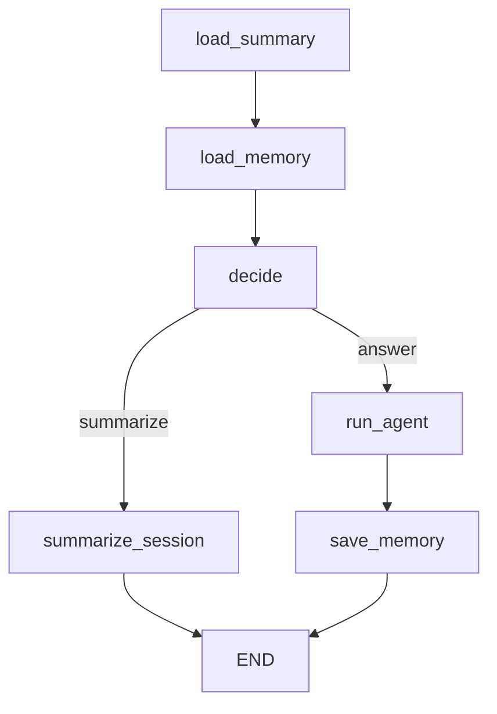

# letta-graph-chat: Letta-style Memory Graph Agent Demo

A modern memory-augmented conversational agent, built with LangGraph and inspired by Letta’s memory system.  
Unlike standard chat memory, this agent can **summarize, store, and reuse knowledge across sessions** using a hybrid short/long-term memory architecture.

## Why Letta-style Memory?

Typical conversational AI agents using LangChain's built-in memory only retain short-term chat history (windowed buffer or simple summary).  
This PoC implements a Letta-inspired hybrid memory structure, combining:

- **Short-term memory:** Recent chat turns for context continuity
- **Long-term memory:** Periodic session summaries, stored in a vector database for scalable recall and re-injection
- **Knowledge aggregation:** Summaries and context can be reused across sessions, not just within a single chat

**Why does this matter?**  

- Enables agents to "remember" across sessions (persistent context)
- Avoids context bloat and token overflow by summarizing and pruning
- Supports scalable, extensible graph-based workflows (add more memory types, tools, or logic nodes as needed)

## Comparison with LangChain's Standard Memory

|                    | LangChain Standard Memory | Letta-Graph Memory (This PoC) |
|--------------------|--------------------------|-------------------------------|
| Short-term History | ✅                        | ✅                            |
| Long-term Summary  | ❌                        | ✅ (vector DB, persistent)    |
| Knowledge Transfer | ❌ (session-limited)      | ✅ (session-spanning)         |
| Extensibility      | △ (limited)              | ✅ (graph/node-based)         |

## 🔧 Features

- Letta-style hybrid memory (short/long-term, summary vector store)
- Session-spanning knowledge aggregation and recall
- Graph-based memory flow for extensibility (easy to add tools, logic, memory layers)

## 🎯 Use Cases

- Knowledge worker assistants
- FAQ/chatbots with persistent context
- Personal context managers

## 📂 Structure

```bash
memory-demo/
├── main.py              # Streamlit app  
├── langgraph_demo.py    # Graph construction and agent logic  
├── memory_adapter.py    # ChromaMemoryAdapter implementation  
├── .env.example         # Sample API key file  
└── pyproject.toml       # uv-based env
```

## 🚀 How to Run

```bash
uv sync
uv run streamlit run main.py
```

Set your `OPENAI_API_KEY` in `.env`.

## Sample Input & Output

```text
User: What are some good points about Tokyo?
Tool: Tokyo is safe, has great public transport, and offers amazing food.

User: What is the weather like in Tokyo today?
Tool: Tokyo's weather today is mostly sunny with a high of 27°C.

User: Can you recommend some popular sightseeing spots in Tokyo?
Tool: Famous tourist spots in Tokyo include Asakusa, Tokyo Tower, and Shibuya Crossing.
```

## 🧠 Memory Flow

1. Input is checked for summarization intent  
2. If summarizing: all history is collected → summary generated → stored in Chroma  
3. If answering: memory is retrieved → prompt is built with history → response saved  

## 🔍 Tech Stack

- Python 3.12  
- LangChain / LangGraph  
- Streamlit  
- Chroma (for vector memory)

## 📹 Optional

A demo GIF showing the interaction flow is available.
TODO:

## Architecture

the graph



## Disclaimer:

This project is provided as a proof of concept (PoC) for demonstration purposes only.
Use at your own risk. No warranty or support is provided for production use.
